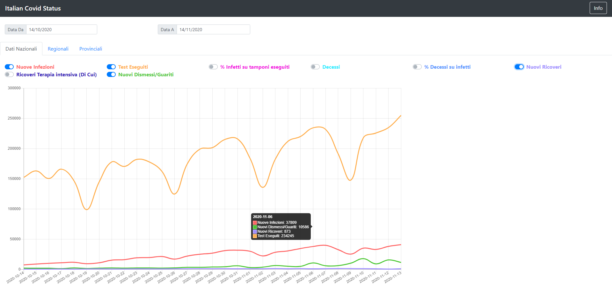
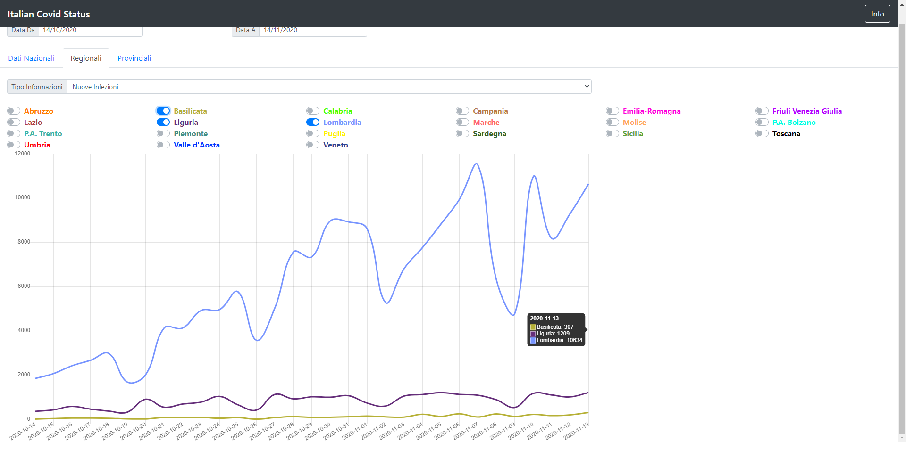
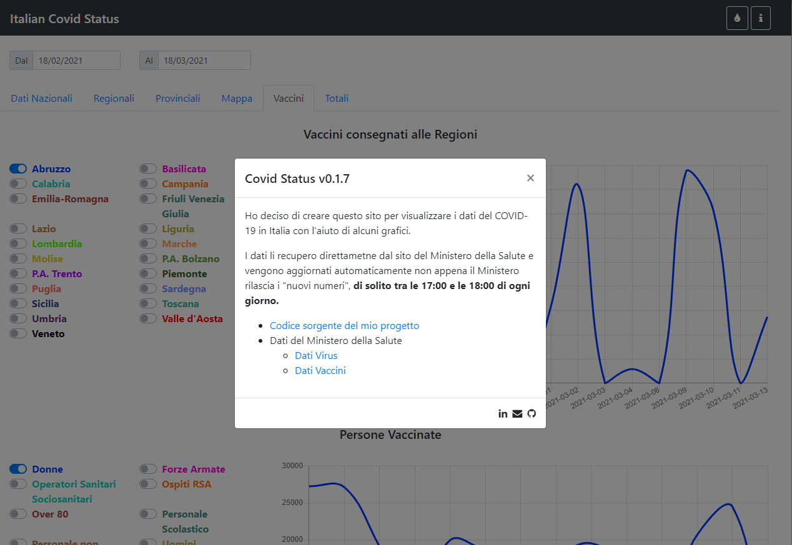
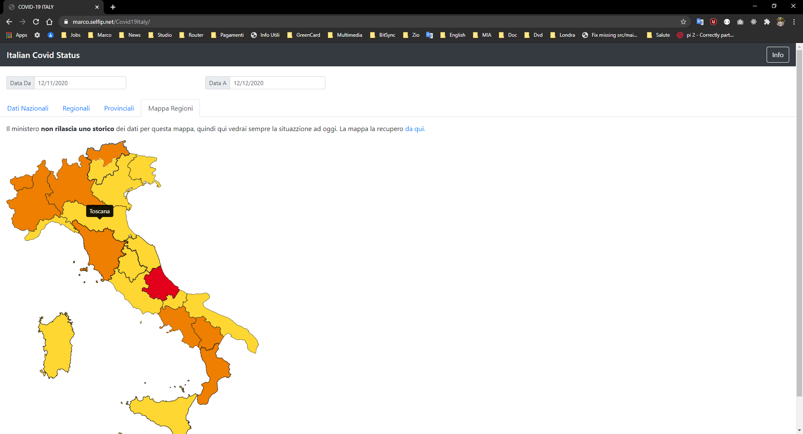
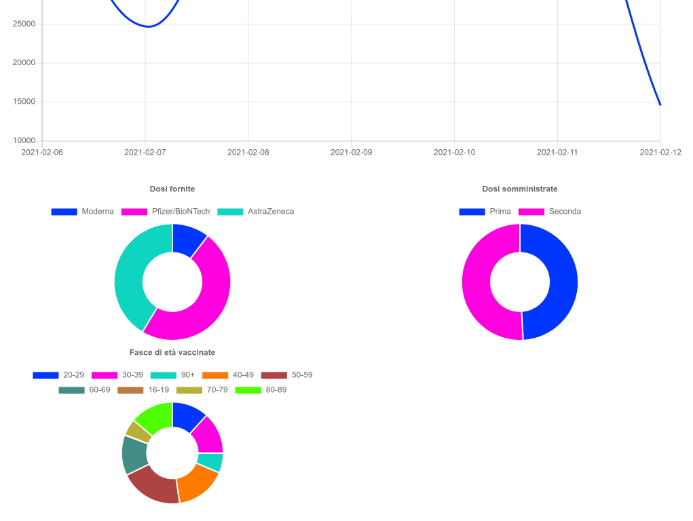

# Covid Status

I created this SpringBoot project to display the COVID-19 updates in a way I think is more clear.
All the data are retrieved from the following public GitHub Repositories:

- [Infections GitHub Repository](https://github.com/pcm-dpc/COVID-19)
- [Vaccines GitHub Repository](https://github.com/italia/covid19-opendata-vaccini)
- **Istat Population Information**: Se datails in the change history below (v0.1.25)
  - **Main Soruce**:
    - [Web Page](http://dati.istat.it/Index.aspx?QueryId=42869)
    - [Web Services](https://www.istat.it/it/metodi-e-strumenti/web-service-sdmx)
    - [Web Services Guide](https://github.com/ondata/guida-api-istat)
    - [Web Service Data Structure](http://sdmx.istat.it/SDMXWS/rest/datastructure/IT1/DCIS_POPRES1/)
    - [Web Service Data Info (Eg: Gender Values)](http://sdmx.istat.it/SDMXWS/rest/codelist/IT1/CL_SEXISTAT1)
  - **Backup Source**:
    - [Geo Demo Istat](http://demo.istat.it/index_e.php)

## Lincense of the Data

- [Infections Data - License](https://creativecommons.org/licenses/by/4.0/deed.it)
- [Vaccines Data - License](https://creativecommons.org/licenses/by/4.0/deed.it)

## TODO

- Update the ISTAT downloader implementation to include in the downloaded data the region code

## My Project Examples

- [Live example of my prject](https://marco.selfip.net/Covid19Italy/)
- [API Documentation](https://marco.selfip.net/Covid19Italy/swagger-ui.html)

## Requirements

- JDK 11
- Maven 3.x.x
- Database (PostgreSQL)
- Custom Dependencies:
  - [My WebJar](https://github.com/marcosolina/WebJar)
  - [My Java Utils](https://github.com/marcosolina/javautils)

## OR

- Docker
- Docker compose

## Running the project with Docker & Docker Compose

~~~~bash
curl -L https://raw.githubusercontent.com/marcosolina/covidstatus/main/Scripts/Docker/downloadAndStartContainers.sh | bash
~~~~

Once the containers are up and runnig open the following links: 

- [http://localhost/Covid19Italy/](http://localhost/Covid19Italy/)
- [http://localhost/Covid19Italy/swagger-ui.html](http://localhost/Covid19Italy/swagger-ui.html)

## Screenshots

## History

- **20/11/2021 v2.0.4**: UI Improvements
- **20/11/2021 v2.0.3**: Adding third dose & booster data
- **19/11/2021 v2.0.2**: Small UI changes
- **25/10/2021 v2.0.1**: Managing new government data structure
- **07/09/2021 v0.2.00**: Small Refactoring
- **07/09/2021 v0.1.31**: Adding chart: vaccinated per region
- **30/08/2021 v0.1.30**: Adding error filter
- **20/08/2021 v0.1.29**: Added an additional implementation to download the population data from the GIT repo were I retrieve the "Vaccine" data
- **09/07/2021 v0.1.28**: Enhancing the % of people vaccinated chart
- **05/07/2021 v0.1.27**: Small changes to allign with the new data scructure adopted by the goverment
- **28/05/2021 v0.1.26**: Small changes to allign with the new data scructure adopted by the goverment (They have removed the different categories "of people", Military, Hospital, over 80 etc)
- **04/05/2021 v0.1.25**: Yesterday the ISTAT was not providing public access to the webservices that I was using to retrieve the Italian population info, but today the access had been restored. I've decided to add a backup source for the Italina population data, [Geo Demo Istat](http://demo.istat.it/index_e.php), so I can have a fallback option if the ISTAT WS goes down again.
- **03/05/2021 v0.1.24**: The ISTAT has changed something, I placed this workaround while investigating on what they have changed
- **26/04/2021 v0.1.23**: Adding % vaccinated people chart
- **24/04/2021 v0.1.22**: Workaround for mono-dose vaccines
- **24/04/2021 v0.1.21**: Small UI improvements
- **24/04/2021 v0.1.20**: Added additional information to better understand the progress of the vaccination
- **20/04/2021 v0.1.19**: Added to the charts the new info discoled by the goverment
- **20/04/2021 v0.1.18**: Quick fix to allign with the new data scructure adopted by the goverment
- **02/04/2021 v0.1.17**: Work around for an issue on the Goverment Repo [Issue](https://github.com/italia/covid19-opendata-vaccini/issues/128)
- **28/03/2021 v0.1.16**: UI Improvements for small screens (Viewport < 567)
- **27/03/2021 v0.1.15**: Adding to the charts the new info added by the government, small refactoring, sending an email to myself if the government changes the data structure again...
- **26/03/2021 v0.1.14**: Managing the new CSV structure of the goverment data
- **20/03/2021 v0.1.13**: Added total vaccines delivered per supplier chart
- **20/03/2021 v0.1.12**: Bug Fixing, Using appropriate HTTP verb, adding Swagger fro API documentation
- **20/03/2021 v0.1.11**: UI Improvements for the Dark Mode
- **19/03/2021 v0.1.10**: Managing empty vaccines tables
- **19/03/2021 v0.1.9**: Adding auto-refresh data switch
- **18/03/2021 v0.1.8**: Updating the PostgreSQL driver & providing docker files to run the whole application inside docker containers
- **14/03/2021 v0.1.7**: Refreshing all the "vaccines" data at every check. I notice that the goverments ammends the data from the previous days.
- **14/03/2021 v0.1.6**: Adding chart totals per age
- **14/03/2021 v0.1.5**: Forcing the refresh of the last available "day" data as the goverments might provide multiple updates on the same day
- **13/03/2021 v0.1.4**: Adding a workaround for the Government data [issue](https://github.com/italia/covid19-opendata-vaccini/issues/106)
- **13/03/2021 v0.1.3**: Adding the "total" tab
- **12/03/2021 v0.1.2**: UI XL Screen improvements, Backend improvements
- **12/03/2021 v0.1.1**: Bug Fixing
- **06/03/2021 v0.1.0**: Refactoring
- **03/03/2021 v0.0.9**: Small refactoring
- **02/03/2021 v0.0.8**: Vaccines bug fixing
- **28/02/2021 v0.0.7**: Added Vaccination data
- **23/12/2020 v0.0.6**: Added Missing CSS styles to manage the Goverment Calendar
- **23/12/2020 v0.0.5**: Added CSS styles to manage the Goverment Calendar
- **13/12/2020 v0.0.4**: Making the tabs responsive
- **12/12/2020 v0.0.3**: Added the dark mode
- **12/12/2020 v0.0.2**: Added the map with the color of the regions
- **15/11/2020 v0.0.1**: First release
