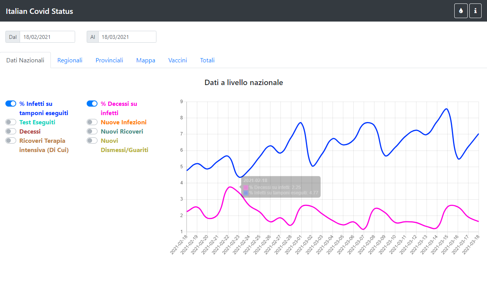
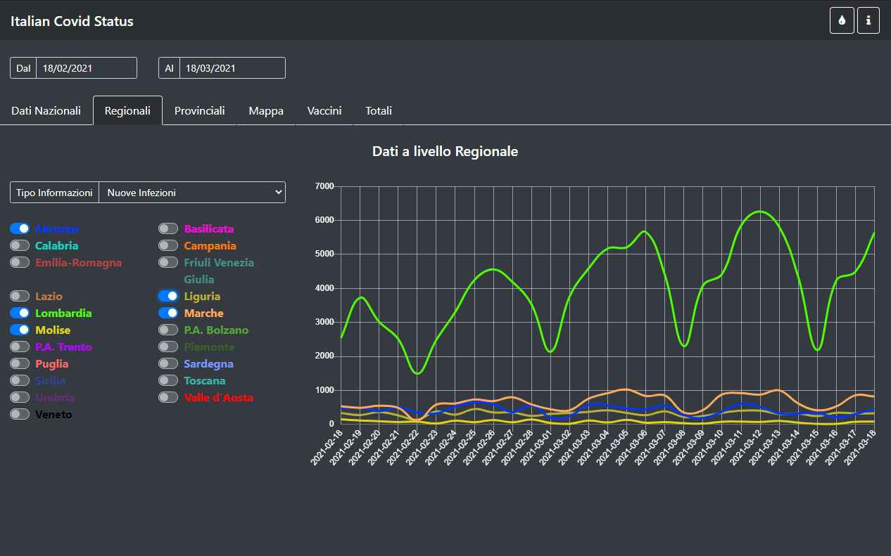
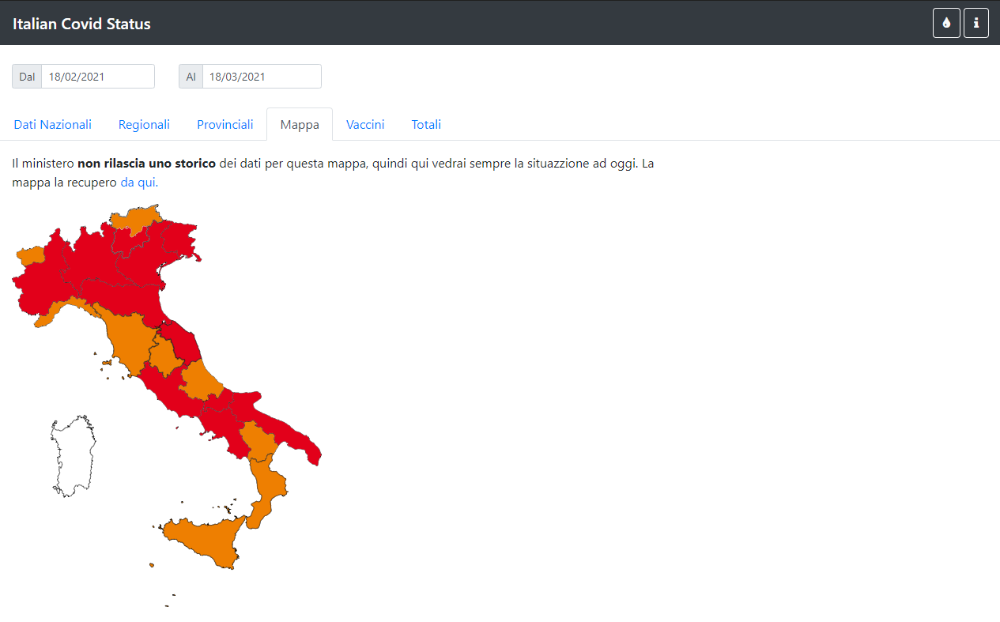
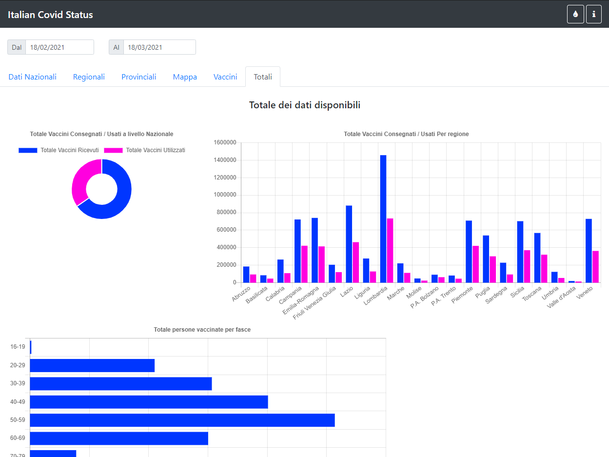

# Covid Status

I created this SpringBoot project to display the COVID-19 updates in a way I think is more clear.
All the data are retrieved from the [Ministero della Salute](https://www.salute.gov.it/), they have made available all the data in a public GitHub Repositories:

- [Infections GitHub Repository](https://github.com/pcm-dpc/COVID-19)
- [Vaccines GitHub Repository](https://github.com/italia/covid19-opendata-vaccini)

## Examples

- [Live example of my prject](https://marco.selfip.net/Covid19Italy/)
- [API Documentation](https://marco.selfip.net/Covid19Italy/swagger-ui.html)

## Requirements

- JDK 11
- Maven 3.x.x
- Database (PostgreSQL)
- Custom Dependencies:
  - [My WebJar](https://github.com/marcosolina/WebJar)
  - [My Java Utils](https://github.com/marcosolina/javautils)

## OR

- Docker
- Docker compose

## Running the project with Docker & Docker Compose

~~~~bash
curl -L https://raw.githubusercontent.com/marcosolina/covidstatus/main/Scripts/Docker/downloadAndStartContainers.sh | bash
~~~~

Once the containers are up and runnig open the following links: 

- [http://localhost/Covid19Italy/](http://localhost/Covid19Italy/)
- [http://localhost/Covid19Italy/swagger-ui.html](http://localhost/Covid19Italy/swagger-ui.html)

## Screenshots

## History

- **27/03/2021 v0.1.15**: Adding to the charts the new info added by the government, small refactoring, sending an email to myself if the government changes the data structure again...
- **26/03/2021 v0.1.14**: Managing the new CSV structure of the goverment data
- **20/03/2021 v0.1.13**: Added total vaccines delivered per supplier chart
- **20/03/2021 v0.1.12**: Bug Fixing, Using appropriate HTTP verb, adding Swagger fro API documentation
- **20/03/2021 v0.1.11**: UI Improvements for the Dark Mode
- **19/03/2021 v0.1.10**: Managing empty vaccines tables
- **19/03/2021 v0.1.9**: Adding auto-refresh data switch
- **18/03/2021 v0.1.8**: Updating the PostgreSQL driver & providing docker files to run the whole application inside docker containers
- **14/03/2021 v0.1.7**: Refreshing all the "vaccines" data at every check. I notice that the goverments ammends the data from the previous days.
- **14/03/2021 v0.1.6**: Adding chart totals per age
- **14/03/2021 v0.1.5**: Forcing the refresh of the last available "day" data as the goverments might provide multiple updates on the same day
- **13/03/2021 v0.1.4**: Adding a workaround for the Government data [issue](https://github.com/italia/covid19-opendata-vaccini/issues/106)
- **13/03/2021 v0.1.3**: Adding the "total" tab
- **12/03/2021 v0.1.2**: UI XL Screen improvements, Backend improvements
- **12/03/2021 v0.1.1**: Bug Fixing
- **06/03/2021 v0.1.0**: Refactoring
- **03/03/2021 v0.0.9**: Small refactoring
- **02/03/2021 v0.0.8**: Vaccines bug fixing
- **28/02/2021 v0.0.7**: Added Vaccination data
- **23/12/2020 v0.0.6**: Added Missing CSS styles to manage the Goverment Calendar
- **23/12/2020 v0.0.5**: Added CSS styles to manage the Goverment Calendar
- **13/12/2020 v0.0.4**: Making the tabs responsive
- **12/12/2020 v0.0.3**: Added the dark mode
- **12/12/2020 v0.0.2**: Added the map with the color of the regions
- **15/11/2020 v0.0.1**: First release
